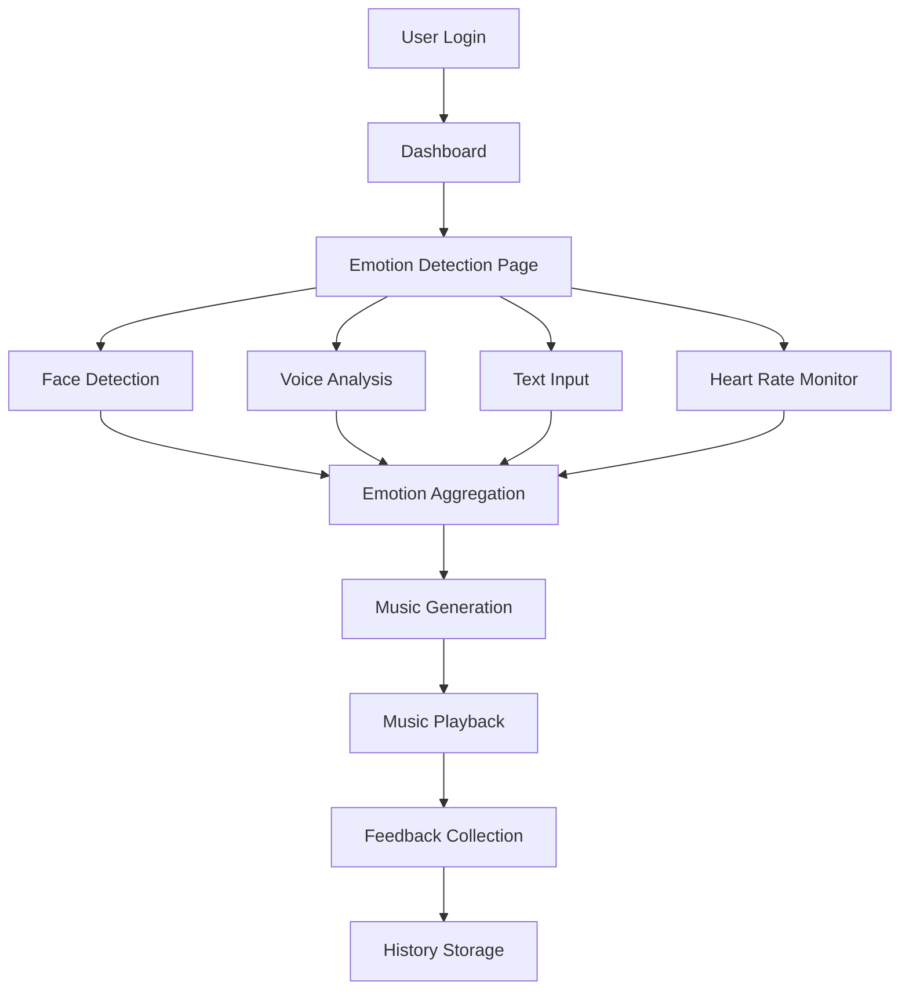

# Smart Care - Complete System Documentation

## 📋 Table of Contents

1. [System Overview](#system-overview)
2. [Architecture](#architecture)
3. [Technology Stack](#technology-stack)
4. [Emotion Detection System](#emotion-detection-system)
5. [Music Generation System](#music-generation-system)
6. [Component Breakdown](#component-breakdown)
7. [Current Limitations & Issues](#current-limitations--issues)

---

## System Overview

**Smart Care** is an AI-powered multimodal music therapy system that:
1. Detects user emotions through multiple input methods (face, voice, text, heart rate)
2. Aggregates emotion data to determine dominant emotional state
3. Generates therapeutic music tailored to improve the user's emotional well-being
4. Provides voice-interactive guidance throughout the experience
5. Collects feedback to continuously improve recommendations

**Core Philosophy**: The music is *therapeutic*, not reflective - we generate calming music for anger, uplifting music for sadness, etc.

---

## Architecture



**Data Flow**:
1. **Input Layer**: Multiple emotion detection modalities
2. **Processing Layer**: Emotion aggregation and analysis
3. **Generation Layer**: Music synthesis based on emotions
4. **Feedback Loop**: User ratings improve future recommendations

---

## Technology Stack

### 🎯 **Framework & Core**

| Technology | Version | Purpose | Usage in Project |
|------------|---------|---------|------------------|
| **Next.js** | 14.2.x | React framework | • App routing (`app/` directory)<br>• Server-side rendering<br>• File-based routing<br>• API routes (future backend) |
| **React** | 18.3.x | UI library | • Component architecture<br>• State management with hooks<br>• Context API for global state |
| **TypeScript** | 5.4.x | Type safety | • Type definitions in `lib/types.ts`<br>• Interface enforcement<br>• Better IDE support |

### 🎨 **Styling & UI**

| Technology | Version | Purpose | Usage in Project |
|------------|---------|---------|------------------|
| **Tailwind CSS** | 3.4.x | Utility-first CSS | • Global styles in `app/globals.css`<br>• Responsive design<br>• Dark theme implementation<br>• Custom CSS variables |
| **Framer Motion** | 11.0.x | Animation library | • Page transitions<br>• Card animations<br>• Button hover effects<br>• Floating background orbs<br>• Loading spinners |
| **Lucide React** | 0.563.x | Icon library | • UI icons (Mail, Lock, User, etc.)<br>• Emotion indicators<br>• Navigation icons |

### 🎵 **Audio & Music**

| Technology | Version | Purpose | Usage in Project |
|------------|---------|---------|------------------|
| **Tone.js** | 15.0.x | Web Audio framework | • Music synthesis (`lib/musicGeneration.ts`)<br>• Instrument creation (PolySynth, MembraneSynth)<br>• Tempo control (Transport)<br>• Note sequencing and loops<br>• Audio effects |

**Tone.js Usage Details**:
- **PolySynth**: Creates polyphonic synthesizers for melodic instruments (piano, guitar, harp, etc.)
- **MembraneSynth**: Generates percussive sounds (drums, tabla)
- **Transport**: Controls tempo (BPM) and timing
- **Loop**: Repeats musical patterns
- **Oscillator types**: sine, triangle, sawtooth, square for different timbres
- **ADSR Envelope**: Attack, Decay, Sustain, Release for note shaping

### 🤖 **AI & Machine Learning**

| Technology | Version | Purpose | Usage in Project |
|------------|---------|---------|------------------|
| **TensorFlow.js** | 4.20.x | ML library | • Face landmark detection<br>• Emotion recognition (future)<br>• Browser-based inference |
| **@tensorflow-models/face-landmarks-detection** | 1.0.x | Face detection | • Facial expression analysis<br>• Real-time webcam processing<br>• 468-point face mesh |

**Current ML Implementation**:
- **Face Detection**: Uses MediaPipe FaceMesh model via TensorFlow.js
- **Voice Detection**: Web Speech API (browser native)
- **Text Analysis**: Keyword matching algorithm (custom implementation)

⚠️ **Note**: Currently using *simulated* emotion detection with random values. Real ML models need to be integrated.

### 🎤 **Voice & Speech**

| Technology | Type | Purpose | Usage in Project |
|------------|------|---------|------------------|
| **Web Speech API** | Browser API | Speech recognition | • Voice command processing<br>• Text-to-speech for assistant<br>• Real-time voice emotion capture |
| **MediaStream API** | Browser API | Media capture | • Webcam access for face detection<br>• Microphone access for voice<br>• getUserMedia() implementation |

### 💾 **Data Storage**

| Technology | Type | Purpose | Usage in Project |
|------------|------|---------|------------------|
| **localStorage** | Browser storage | Client-side data | • User authentication (`user` key)<br>• User credentials (`smart_care_users`)<br>• Session management<br>• Preferences storage |

⚠️ **Security Note**: Passwords are stored in plain text (dev only). Production needs bcrypt + backend database.

### 📱 **Device Integration**

| Technology | Type | Purpose | Usage in Project |
|------------|------|---------|------------------|
| **Web Bluetooth API** | Browser API | BLE device connection | • Heart rate monitor pairing<br>• Real-time BPM tracking<br>• Health data integration |

---

## Emotion Detection System

### 🔍 **Detection Methods**

#### 1. **Face Detection** (`components/EmotionDetector/FaceDetection.tsx`)

**Technologies Used**:
- **react-webcam** (7.2.x): Webcam component wrapper
- **@tensorflow/tfjs**: Core TensorFlow framework
- **@tensorflow-models/face-landmarks-detection**: Face mesh model

**Process**:
1. Access webcam via `getUserMedia()`
2. Capture video frame every 100ms
3. Load MediaPipe FaceMesh model
4. Detect 468 facial landmarks
5. ⚠️ **Currently**: Returns random emotions (70-95% confidence)
6. **Should**: Analyze landmark positions to determine expression

**Emotion Mapping** (Future Implementation):
- Mouth corners up → Happy
- Eyebrows down, mouth corners down → Sad/Angry
- Eyes wide, eyebrows up → Surprised/Fearful
- Neutral baseline → Neutral

#### 2. **Voice Detection** (`components/EmotionDetector/VoiceDetection.tsx`)

**Technologies Used**:
- **Web Speech API**: `webkitSpeechRecognition`
- **MediaRecorder API**: Audio blob capture

**Process**:
1. Request microphone permission
2. Record audio for 5-10 seconds
3. Convert to Blob
4. ⚠️ **Currently**: Returns random emotions (65-90% confidence)
5. **Should**: Analyze pitch, tone, speed, volume

**Voice Features to Analyze** (Future):
- **Pitch**: Higher pitch → Excitement/Fear, Lower pitch → Sadness/Calm
- **Speed**: Fast speech → Anxiety/Anger, Slow speech → Depression/Calm
- **Volume**: Loud → Anger/Excitement, Quiet → Sadness/Fear
- **Tone**: Analyze frequency spectrum for emotional markers

#### 3. **Text Analysis** (`components/EmotionDetector/TextAnalysis.tsx`)

**Technologies Used**:
- **Custom keyword matching algorithm** (in `lib/emotionDetection.ts`)

**Process**:
1. User types text describing how they feel
2. Convert text to lowercase
3. Match against emotion keyword dictionaries
4. Score each emotion based on keyword count
5. Detect negations ("not happy" reduces happy score)
6. Normalize and return top 3 emotions

**Keyword Dictionaries** (`lib/emotionDetection.ts`):
```typescript
{
  happy: ['happy', 'joy', 'great', 'wonderful', 'excited', 'love', 'amazing', ...],
  sad: ['sad', 'unhappy', 'depressed', 'down', 'lonely', ...],
  angry: ['angry', 'mad', 'furious', 'frustrated', 'hate', ...],
  fearful: ['afraid', 'scared', 'anxious', 'nervous', 'panic', ...],
  // ... etc
}
```

**Confidence Calculation**:
- Count keyword matches per emotion
- Boost primary emotion to 75-92%
- Distribute remaining confidence to secondary emotions

#### 4. **Heart Rate Monitor** (`components/EmotionDetector/HeartRateMonitor.tsx`)

**Technologies Used**:
- **Web Bluetooth API**: BLE device connection
- **Heart Rate Service** (UUID: 0x180D): Standard BLE service

**Process**:
1. Request Bluetooth device with heart rate service
2. Connect to device
3. Subscribe to heart rate characteristic
4. Read real-time BPM values
5. Display current heart rate
6. Use in music tempo adjustments

**Heart Rate Impact**:
- HR > 90: Generate slower, calming music
- HR < 60: Generate slightly faster music
- Normal (60-90): Use emotion-based tempo

### 📊 **Emotion Aggregation** (`lib/emotionDetection.ts::aggregateEmotions()`)

**Weighting System**:
- **Face emotions**: 40% weight (most reliable)
- **Voice emotions**: 35% weight (good reliability)
- **Text emotions**: 25% weight (user self-report)

**Algorithm**:
```
For each emotion type (happy, sad, angry, etc.):
  score = (face_confidence × 0.4) + (voice_confidence × 0.35) + (text_confidence × 0.25)
  
Dominant emotion = max(scores)
```

**Example**:
- Face: 80% Happy,  20% Neutral
- Voice: 70% Happy, 30% Surprised
- Text: 90% Sad, 10% Happy

```
Happy score = (0.80 × 0.4) + (0.70 × 0.35) + (0.10 × 0.25) = 0.59
Sad score   = (0 × 0.4) + (0 × 0.35) + (0.90 × 0.25) = 0.225
→ Result: 59% Happy
```

---

## Music Generation System

### 🎼 **Music Synthesis** (`lib/musicGeneration.ts`)

**Core Technology**: **Tone.js** (Web Audio API wrapper)

#### **Therapeutic Mapping**

Music is designed to **improve mood**, not match it:

| Detected Emotion | Therapeutic Goal | Tempo (BPM) | Key | Mode | Instruments |
|------------------|------------------|-------------|-----|------|-------------|
| Sad | Uplift gradually | 75 | C | Major | Piano, Harp, Flute |
| Angry | Calm down | 85 | G | Major | Piano, Flute, Bell |
| Fearful | Provide comfort | 70 | C | Major | Piano, Harp, Bell |
| Neutral | Gentle energy boost | 95 | G | Major | Piano, Guitar, Bell |
| Happy | Maintain positivity | 105 | C | Major | Piano, Guitar, Harp |
| Surprised | Calm curiosity | 90 | G | Major | Piano, Bell, Harp |
| Disgusted | Cleanse and refresh | 80 | C | Major | Flute, Harp, Bell |

#### **Instrument Synthesis**

Each instrument has custom **Tone.js synth configuration**:

**Piano** (PolySynth):
```typescript
oscillator: { type: 'sine' },
envelope: { attack: 0.005, decay: 0.3, sustain: 0.1, release: 1.2 }
```

**Harp** (PolySynth):
```typescript
oscillator: { type: 'triangle3' },
envelope: { attack: 0.001, decay: 1.0, sustain: 0.0, release: 1.5 }
```

**Flute** (PolySynth):
```typescript
oscillator: { type: 'sine3' },
envelope: { attack: 0.05, decay: 0.1, sustain: 0.6, release: 0.8 }
```

**Drums/Tabla** (MembraneSynth):
```typescript
pitchDecay: 0.05,
octaves: 6-8,
envelope: { attack: 0.001, decay: 0.4, sustain: 0.01, release: 1.4 }
```

#### **Melody Generation** (`generateMelody()`)

**Musical Scales**:
```typescript
C Major: ['C4', 'D4', 'E4', 'F4', 'G4', 'A4', 'B4', 'C5']
G Major: ['G4', 'A4', 'B4', 'C5', 'D5', 'E5', 'F#5', 'G5']
A Minor: ['A3', 'B3', 'C4', 'D4', 'E4', 'F4', 'G4', 'A4']
// ... etc
```

**Melody Patterns** (12 different patterns for variety):
```typescript
[0, 2, 4, 2, 0, 2, 4, 7]  // Ascending
[0, 4, 7, 4, 0, 2, 4, 0]  // Arpeggio
[4, 2, 0, 2, 4, 7, 4, 0]  // Wave
[0, 2, 1, 3, 2, 4, 3, 5]  // Stepwise
// ... 8 more patterns
```

**Rhythm Patterns** (6 different types):
```typescript
['4n', '4n', '4n', '4n', '4n', '4n', '4n', '4n']  // Quarter notes
['8n', '8n', '4n', '8n', '8n', '4n', '4n', '4n']  // Mixed
['4n', '8n', '8n', '4n', '4n', '8n', '8n', '4n']  // Syncopated
// ... 3 more patterns
```

**Note Durations**:
- `4n` = Quarter note
- `8n` = Eighth note
- `2n` = Half note
- `16n` = Sixteenth note

**Algorithm**:
1. Select random melodic pattern (based on seed)
2. Select random rhythm pattern
3. Add 30% random variation to notes
4. Transpose pattern across 4 iterations
5. Add harmonic notes (20% chance)
6. Create unique ending phrase
7. Return final note sequence

⚠️ **Current Issue**: Music sounds "childish" because:
- Limited scale variations
- Simple harmonic progressions
- Basic rhythm patterns
- No chord progressions
- Synthetic instrument sounds
- Repetitive melodies

#### **Music Playback** (`playMusic()`)

**Tone.js Transport System**:
```typescript
1. Set BPM: Tone.Transport.bpm.value = 90
2. Create Loop: new Tone.Loop(callback, '4n')
3. Trigger notes: synth.triggerAttackRelease(note, duration, time)
4. Start transport: Tone.Transport.start()
5. Stop after duration: setTimeout(() => Tone.Transport.stop())
```

---

## Component Breakdown

### 📂 **Project Structure**

```
e:\Smart_Care\
├── app/                          # Next.js app directory
│   ├── dashboard/
│   │   └── page.tsx             # Main dashboard after login
│   ├── detect-emotion/
│   │   └── page.tsx             # Emotion detection flow
│   ├── feedback/
│   │   └── page.tsx             # Feedback submission
│   ├── history/
│   │   └── page.tsx             # Music history
│   ├── login/
│   │   └── page.tsx             # Authentication (FIXED)
│   ├── music/
│   │   └── page.tsx             # Music player page
│   ├── preferences/
│   │   └── page.tsx             # User preferences
 ├── globals.css               # Global styles (REDESIGNED)
│   ├── layout.tsx               # Root layout with providers
│   └── page.tsx                 # Landing/home page
│
├── components/                   # Reusable UI components
│   ├── EmotionDetector/
│   │   ├── FaceDetection.tsx    # Webcam + TensorFlow face detection
│   │   ├── VoiceDetection.tsx   # Microphone + speech recognition
│   │   ├── TextAnalysis.tsx     # Text input emotion analysis
│   │   └── HeartRateMonitor.tsx # Bluetooth heart rate device
│   ├── MoodBackground.tsx       # Dynamic background based on mood
│   ├── MusicPlayer.tsx          # Tone.js music playback UI
│   ├── VoiceAssistant.tsx       # Voice interaction component
│   └── EmotionResults.tsx       # Display emotion scores
│
├── context/                      # React Context providers
│   ├── MoodContext.tsx          # Global mood state
│   └── PreferencesContext.tsx   # User preferences state
│
└── lib/                          # Core business logic
    ├── authService.ts           # User auth (NEW - FIXED)
    ├── emotionDetection.ts      # Emotion detection algorithms
    ├── musicGeneration.ts       # Tone.js music synthesis
    ├── feedbackAnalysis.ts      # Feedback processing
    ├── voiceAssistant.ts        # Voice commands handler
    ├── types.ts                 # TypeScript definitions
    └── bluetooth.d.ts           # Bluetooth type definitions
```

### 🔑 **Key Components**

#### **1. Authentication** ([`app/login/page.tsx`](file:///e:/Smart_Care/app/login/page.tsx))
- **Purpose**: User login/registration
- **Technologies**: React state, localStorage, authService
- **Features**: Email/password validation, demo mode, error handling

#### **2. Emotion Detection Flow** ([`app/detect-emotion/page.tsx`](file:///e:/Smart_Care/app/detect-emotion/page.tsx))
- **Purpose**: Orchestrate multi-modal emotion detection
- **Steps**: Face → Voice → Text → Heart Rate → Analysis
- **Technologies**: TensorFlow.js, Web Speech API, Web Bluetooth

#### **3. Music Player** ([`components/MusicPlayer.tsx`](file:///e:/Smart_Care/components/MusicPlayer.tsx))
- **Purpose**: Play generated therapeutic music
- **Technologies**: Tone.js, React hooks
- **Features**: Play/pause, progress bar, volume control

#### **4. Voice Assistant** ([`components/VoiceAssistant.tsx`](file:///e:/Smart_Care/components/VoiceAssistant.tsx))
- **Purpose**: Voice interaction and guidance
- **Technologies**: Web Speech API (recognition + synthesis)
- **Commands**: "Start detection", "Play music", "Go to dashboard", etc.

---

## Current Limitations & Issues

### ⚠️ **Emotion Detection Problems**

**Issue**: Detecting wrong emotions

**Root Cause**: Currently using **simulated/random** emotion detection

**Affected Files**:
- [`lib/emotionDetection.ts`](file:///e:/Smart_Care/lib/emotionDetection.ts):
  - Line 10: `const primaryEmotion = emotions[Math.floor(Math.random() * emotions.length)]`
  - Line 33: Random emotion selection for voice
  - Text analysis works but could be improved

**Solution Needed**:
1. **Face**: Implement actual TensorFlow emotion recognition model
2. **Voice**: Add audio analysis library (pitch, tone, speed detection)
3. **Text**: Enhance keyword dictionary, add sentiment analysis library

### 🎵 **Music Quality Problems**

**Issue**: Music sounds like "kids music", not professional

**Root Causes**:
1. **Simple Melodies**: Only 8-note scale patterns
2. **Basic Instruments**: Synthetic oscillators, not realistic samples
3. **No Harmony**: Single melodic line, no chord progressions
4. **Repetitive**: Same patterns loop without development
5. **Limited Dynamics**: Fixed velocity, no crescendo/decrescendo

**Solution Needed**:
1. Add **chord progressions** (I-IV-V-I, ii-V-I, etc.)
2. Use **audio samples** instead of synthetic oscillators
3. Implement **musical structure** (intro, verse, chorus, bridge, outro)
4. Add **dynamics** and **expression**
5. Include **bass lines** and **harmonic accompaniment**
6. Add **reverb**, **delay**, and other **effects**

---

## Future Improvements

### 🚀 **Recommended Next Steps**

1. **Integrate Real ML Models**:
   - Replace random emotions with actual TensorFlow models
   - Use pre-trained emotion recognition (fer2013 dataset)
   - Add voice emotion library (e.g., beyondverbal, vokaturi)

2. **Enhance Music Quality**:
   - Integrate **Tone.js Sampler** with realistic instrument samples
   - Add **chord progression** generator
   - Implement proper **music theory** (harmonic progressions, voice leading)
   - Add **polyphonic textures** (melody + harmony + bass)
   - Include **effects chain** (reverb, compression, EQ)

3. **Backend Integration**:
   - Replace localStorage with proper database (PostgreSQL, MongoDB)
   - Implement secure authentication (JWT, OAuth)
   - Store music history and feedback in DB
   - Add AI music generation API (OpenAI Jukebox, Google Magenta)

4. **Production Readiness**:
   - Hash passwords with bcrypt
   - Add HTTPS/SSL
   - Implement rate limiting
   - Add error boundary components
   - Performance optimization (code splitting, lazy loading)

---

## Technology Quick Reference

| What We Need | Technology Used | File Location |
|--------------|-----------------|---------------|
| Face detection | TensorFlow.js + FaceMesh | `components/EmotionDetector/FaceDetection.tsx` |
| Voice capture | Web Speech API | `components/EmotionDetector/VoiceDetection.tsx` |
| Text analysis | Custom keyword matching | `lib/emotionDetection.ts` |
| Heart rate | Web Bluetooth API | `components/EmotionDetector/HeartRateMonitor.tsx` |
| Music synthesis | Tone.js | `lib/musicGeneration.ts` |
| Animations | Framer Motion | Throughout UI components |
| Routing | Next.js App Router | `app/` directory |
| State management | React Context | `context/` directory |
| Styling | Tailwind CSS | `app/globals.css` |
| Authentication | Custom localStorage service | `lib/authService.ts` |

---

**Created**: February 14, 2026
**Version**: 1.0.0
**Project**: Smart Care AI Music Therapy System
